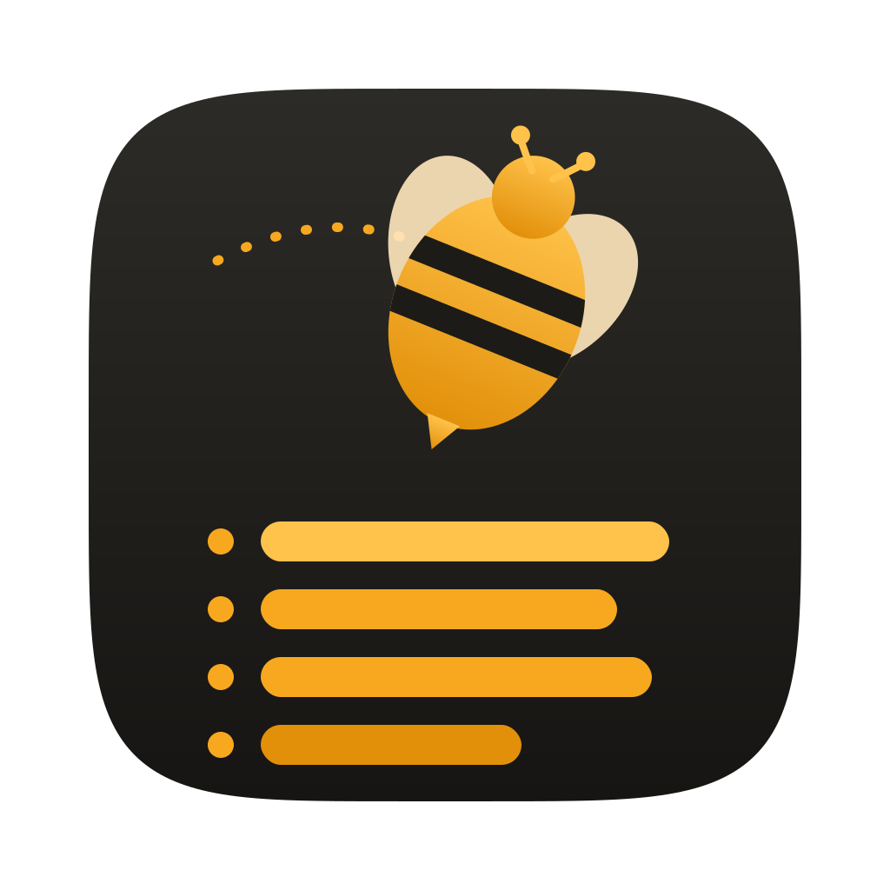
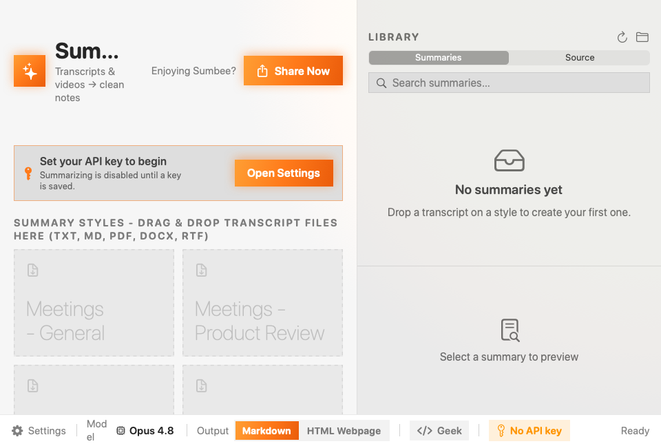
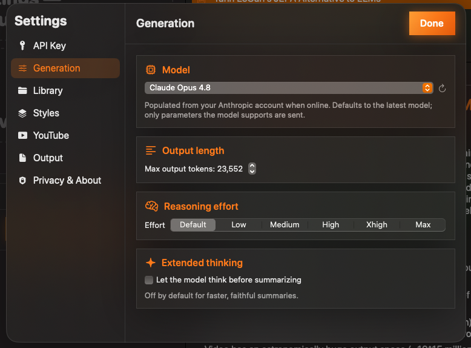
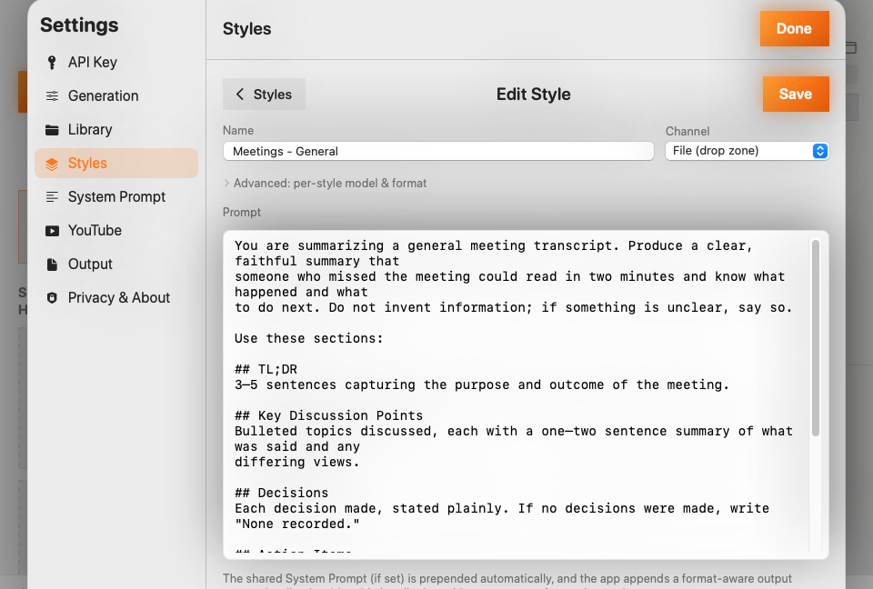
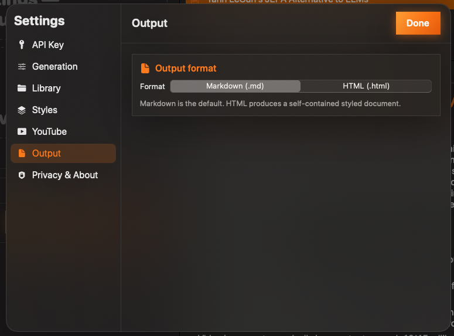

<div align="center">



# Sumbee

**Turn meeting transcripts and YouTube videos into clean, structured summaries you own.**

A native macOS app. Local-first: your summaries are plain Markdown (or HTML) files on your own
hard drive, in a folder you choose. You own them like any private local file; the app never
uploads or sees your library. No proprietary format, no lock-in.

[](../../releases/latest)

**macOS 15 (Sequoia) or later · Apple Silicon (M1 or newer)** · unsigned build (see install steps below)



</div>

---

## Why Sumbee

- **You own your data.** Summaries and archived sources are plain files on your hard drive (in
  `~/Sumbee Summaries`, or anywhere you choose), yours like any private local file, usable in
  Finder, Obsidian, or git with the app closed. The app never uploads or sees your library; the
  on-disk files *are* the source of truth. **No proprietary format, no lock-in.**
- **Local-first.** Everything stays on your Mac except the two actions you start: sending
  transcript text to the Anthropic API to summarize, and fetching YouTube captions via `yt-dlp`.
- **Fully private summarization is coming.** Local models via **Ollama** (on-device, nothing leaves
  your Mac) are on the roadmap.
- **Styles are just prompts.** Each summary **style** is an editable prompt that also names a
  folder in your library: make one per use-case (standups, interviews, research videos…).
- **Native & beautiful.** SwiftUI + AppKit, real vibrancy/"glass", automatic light/dark, an
  orange accent, and a single responsive window.
- **Zero third-party dependencies.** Builds offline with only the Apple Swift toolchain.

## Features

- **Drag-and-drop transcripts** (`.md`, `.txt`, `.pdf`, `.docx`, `.rtf`) onto a style → a saved
  summary, with the original safely archived. Drop many at once: they queue and run one at a time,
  and one failure never aborts the batch (with automatic, backed-off retries for transient errors).
- **YouTube → summary, video or whole playlist.** A left mode rail switches between Transcripts and
  YouTube. In YouTube mode, paste a single video or a **playlist** URL: a playlist fetches an inline
  checklist (with already-summarized videos pre-excluded) and summarizes the ones you pick, one at a
  time, through a chosen style. **Fetched playlists are kept** under "Your playlists" so you can come
  back and summarize more (with a Refresh to pick up new videos). If YouTube asks you to "confirm
  you're not a bot," Sumbee auto-retries once with a different player; if that still fails, update
  yt-dlp in Settings or switch the YouTube access mode (Settings ▸ YouTube) to use your Chrome or
  Safari login.
- **Regenerate.** Re-run any saved summary from its archived original with a different style,
  model, or format. Produces a new summary, the original is kept.
- **Live streaming preview.** Watch the summary write itself into the preview pane as it generates,
  and keep browsing while it runs: select any summary to read it during a generation, then click
  **Watch** in the bottom bar to return to the live stream.
- **Library search.** Instant title filter (⌘F); **⌘N** starts a new style.
- **Full style CRUD** (name, channel, prompt), reflected live in the main window, with optional
  **per-style model & output-format overrides**.
- **Shared system prompt.** One editable prompt is prepended to *every* style, so common
  instructions live in one place instead of being duplicated across styles.
- **Unified, roomy prompt editing.** The system prompt, each style's prompt, and the HTML-styling
  prompt are all edited in one full-height, non-modal editor inside Settings: many lines visible
  at once, no cramped floating sheet.
- **Live library browser** grouped by style, with preview, reveal-in-Finder, open, copy, delete.
- **Readable, resizable preview.** Increase or decrease the preview pane's base font size from its
  toolbar; the size sticks across sessions and scales headings proportionally.
- **Secure key storage** in the macOS Keychain; summarizing is gated until a valid key is set, and
  re-gated automatically on an auth failure.
- **Markdown or HTML output**, with an optional shared HTML-styling prompt. Both render in-app: the
  Markdown preview renders tables and clickable links, and HTML summaries render with their own
  styling in a built-in viewer that stays basic and private (no scripts run, no remote loads, link
  clicks open in your browser). Interactive HTML gets a one-click **View in Browser** button. Drag a
  summary to Finder, or **space-bar Quick Look** it.
- **Geek mode.** Flip it on in the bottom bar to preview the exact prompt and an estimated token
  count before each summary is sent.
- **Model-capability aware:** defaults to the latest Claude model and only sends parameters a given
  model accepts (e.g. it won't send `temperature` to a model that rejects it).

## Screenshots

| Settings & model picker | Style editor | Summary output |
|---|---|---|
|  |  |  |

## Download & install

> **Heads-up:** the build is **ad-hoc signed, not notarized** (no paid Apple Developer
> certificate), so macOS Gatekeeper will warn on first launch. The steps below clear that, and you
> only do it once.

1. Download **`Sumbee-0.6.0.zip`** from the [latest release](../../releases/latest).
2. Unzip it and drag **Sumbee.app** to your **Applications** folder.
3. Remove the quarantine flag (the reliable way to open an unsigned app), then launch:
   ```bash
   xattr -dr com.apple.quarantine /Applications/Sumbee.app
   open /Applications/Sumbee.app
   ```
   **Or** without Terminal: right-click **Sumbee.app → Open → Open**. If macOS still blocks it
   (common on recent macOS), go to **System Settings → Privacy & Security**, scroll to the
   "Sumbee was blocked" notice, and click **Open Anyway**.
4. On first launch Sumbee opens to **Settings**: paste your
   [Anthropic API key](https://console.anthropic.com/settings/keys), click **Save & Validate**,
   then drag a transcript onto a style.

**Requirements:** macOS 15 (Sequoia) or later, Apple Silicon (M1 or newer). Optional: [`yt-dlp`](https://github.com/yt-dlp/yt-dlp)
for the YouTube feature (auto-discovered, or installed from Settings).

## Build from source

```bash
git clone https://github.com/wynnwu/Sumbee.git
cd Sumbee

swift run Sumbee        # run a debug build
swift test              # run the unit tests (95)
./scripts/bundle.sh     # produce dist/Sumbee.app (release, ad-hoc signed)
open dist/Sumbee.app
```

**Requirements to build:** Xcode 26 / Swift 6.2 toolchain, macOS 15+.

## How it works on disk

Your library lives at **`~/Sumbee Summaries`** (change it in Settings ▸ Library):

```
~/Sumbee Summaries/
├── Meetings - General/
│   ├── style-definition/style-definition.md     # the style's prompt + metadata
│   └── 2026-06-21 1432 - Q2 Roadmap Sync.md      # a summary
├── YouTube/style-definition/style-definition.md
└── source/                                        # archived copies of every processed input
```

A folder is a "style" if it contains `style-definition/style-definition.md`. Renaming a style
folder (in the app or Finder) keeps its prompt attached via a stable id; deleting a style keeps its
folder and summaries. Everything is plain text you can read, edit, back up, or version yourself.

## Architecture

A SwiftPM package with a testable library and a thin executable shell:

```
Sources/
  Sumbee/                  # executable: main.swift → SumbeeApp.main()
  SumbeeKit/               # all logic + SwiftUI views (unit-tested)
    Models/                # SummaryStyle, Asset, AppSettings, ModelCatalog, Job, OutputFormat
    Services/              # AnthropicClient (SSE), KeychainStore, LibraryStore, StyleStore,
                           # TextExtractor + Extractors (PDF/RTF/Docx/PlainText),
                           # YouTubeService + VTTParser, SummarizationEngine, PromptBuilder,
                           # FrontmatterCodec, HTMLMetaCodec, Sanitizer, DirectoryWatcher, ProcessRunner
    State/                 # AppState (@MainActor root store) + Jobs/Styles extensions
    Views/                 # MainPanel, AssetBrowser, BottomBar, Settings, Design (Theme/Glass/Components)
Tests/SumbeeKitTests/      # FrontmatterCodec, Sanitizer, ModelCatalog, PromptBuilder, VTTParser, …
scripts/                   # bundle.sh + icon helpers
specs/                     # spec-driven design docs (spec, plan, contracts, tasks)
```

Everything the app needs is native: PDFs via PDFKit, RTF via `NSAttributedString`, DOCX via the
system `unzip` + `XMLParser`, the API via `URLSession` SSE, the key via the Security framework,
yt-dlp via `Process`, live refresh via FSEvents. No SPM dependencies, no build-time network.

### Extending it

- **Add a model:** append a `ModelPreset` (with its `ModelCapabilities`) in
  `Models/ModelCatalog.swift`. The request builder consults capabilities, so unsupported
  parameters are never sent, with no other code changes.
- **Add/edit a style:** in-app (Settings ▸ Styles), or edit the `style-definition.md` file in the
  style's library folder directly.
- **Change the default styles:** `Services/DefaultStyles.swift`.

## Roadmap

- **Local models via [Ollama](https://ollama.com)**: fully on-device, fully-private summarization
  (nothing leaves your Mac). *Coming soon.*
- On-device recording, real-time transcription & speaker diarization (see `specs/002`)
- Audio/video transcription (Whisper) for inputs without captions
- Chunked map-reduce for transcripts exceeding the context window
- Per-style model overrides UI, library search/tags
- Signed + notarized universal build; auto-update
- Strict Swift 6 concurrency migration; fuller test suite

## Contributing

Issues and PRs welcome. The design rationale lives in [`specs/`](specs/001-transcript-summarizer/),
worth a skim before larger changes. Please run `swift test` before opening a PR.

## License

[MIT](LICENSE) © 2026 Wynn Wu
